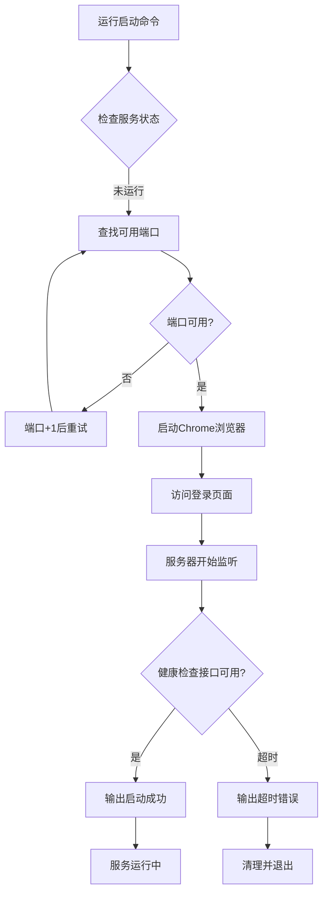
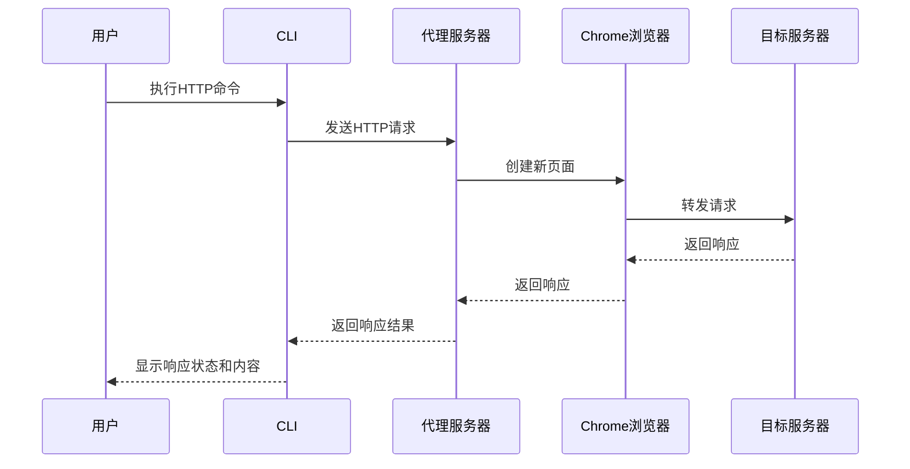
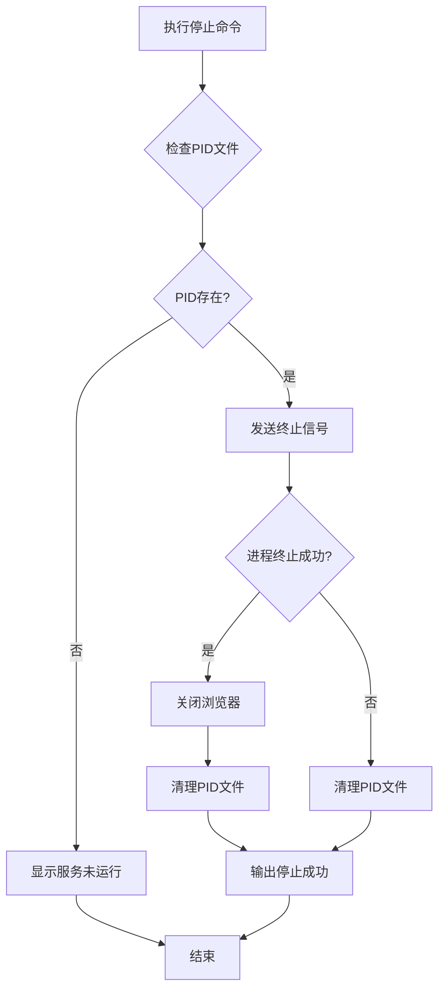

# 产品需求文档

## 1. 项目概述

**项目名称：** my-skill-cli  
**项目类型：** HTTP代理服务工具  
**核心定位：** 基于浏览器自动化的HTTP请求代理工具，通过Chrome浏览器访问目标URL，实现认证后的HTTP请求转发功能。

## 2. 核心功能描述

### 2.1 服务管理功能

| 功能 | 描述 |
|------|------|
| 启动服务 | 启动Chrome浏览器并访问登录页面，在后台运行HTTP代理服务器 |
| 停止服务 | 优雅关闭服务进程，清理PID文件和资源 |
| 查看状态 | 检查服务是否正在运行，显示进程PID和端口 |
| 查看日志 | 查看服务器运行日志和请求记录 |

### 2.2 浏览器自动化功能

- **自动化浏览器启动**：使用Playwright启动Chrome浏览器
- **用户交互式登录**：Chrome浏览器在非无头模式下运行，用户可在真实浏览器中完成登录操作
- **会话保持**：登录成功后，保持浏览器上下文（Context）用于后续请求

### 2.3 HTTP代理功能

支持以下HTTP请求方法的转发代理：

- **GET请求**：转发GET请求到目标URL
- **POST请求**：转发POST请求，支持JSON数据
- **PUT请求**：转发PUT请求，支持JSON数据
- **DELETE请求**：转发DELETE请求到目标URL
- **OPTIONS预检请求**：自动响应CORS预检请求

### 2.4 端口管理功能

- **动态端口分配**：从基础端口开始，自动查找可用端口
- **端口递增**：当端口被占用时自动尝试下一个端口
- **端口记录**：将实际使用的端口记录到PID文件中

### 2.5 日志管理功能

- **请求日志**：记录所有收到的HTTP请求（方法、路径）
- **响应日志**：记录目标服务器的响应状态码
- **错误日志**：记录请求失败和系统错误信息
- **日志文件**：持久化保存到 `server.log` 文件

### 2.6 健康检查功能

- **/health 接口**：提供服务健康状态检查
- **启动等待**：启动命令等待服务真正就绪后再返回成功
- **状态监控**：通过HTTP接口确认服务运行状态

## 3. 用户操作流程

### 3.1 首次启动流程



### 3.2 HTTP请求发送流程



### 3.3 停止服务流程



## 4. 使用场景

### 4.1 典型应用场景

1. **认证网站API访问**：需要登录才能访问的网站API测试
2. **会话保持的请求转发**：保持登录状态的批量请求处理
3. **跨域请求代理**：通过服务端转发解决浏览器跨域限制

### 4.2 命令示例

```bash
# 启动服务
node dist/index.js start

# 查看服务状态
node dist/index.js status

# 发送GET请求
node dist/index.js get https://api.example.com/data

# 发送POST请求
node dist/index.js post https://api.example.com/data '{"name":"test"}'

# 发送PUT请求
node dist/index.js put https://api.example.com/data/1 '{"name":"update"}'

# 发送DELETE请求
node dist/index.js delete https://api.example.com/data/1

# 查看日志
node dist/index.js logs

# 停止服务
node dist/index.js stop
```

## 5. 配置说明

### 5.1 环境变量配置

通过 `.env` 文件配置：

| 变量名 | 默认值 | 说明 |
|--------|--------|------|
| LOGIN_URL | https://example.com/login | 登录页面URL |
| PORT | 3000 | 基础端口号 |

### 5.2 文件依赖

| 文件 | 说明 |
|------|------|
| `server.pid` | 存储服务进程ID和端口，格式：`PID:PORT` |
| `server.log` | 存储服务运行日志 |
| `.env` | 环境变量配置文件 |

## 6. 技术特性

### 6.1 跨平台支持

- **Windows**：支持，使用PowerShell命令
- **macOS**：支持，使用shell命令
- **Linux**：支持，使用shell命令

### 6.2 浏览器支持

- **Chrome**：通过 `channel: 'chrome'` 使用系统已安装的Chrome
- **无需下载**：使用用户系统上已安装的Chrome浏览器

### 6.3 构建工具

- **打包工具**：esbuild
- **输出格式**：ESM (ES Modules)
- **外部依赖**：playwright-core, dotenv, electron, chromium-bidi

### 6.4 错误处理

- **服务未运行**：发送请求时检测并提示
- **PID文件损坏**：自动清理并重新创建
- **端口占用**：自动递增到下一个可用端口
- **启动超时**：30秒超时后自动清理
