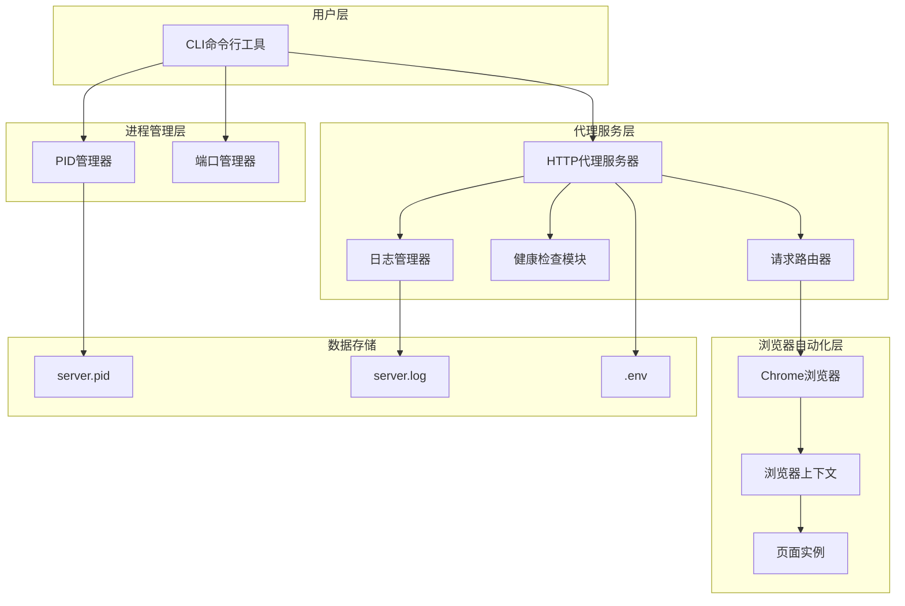
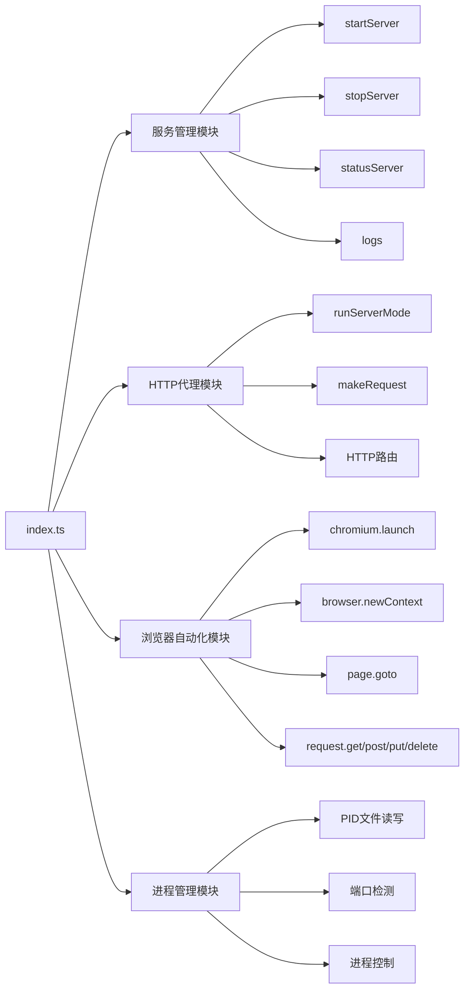
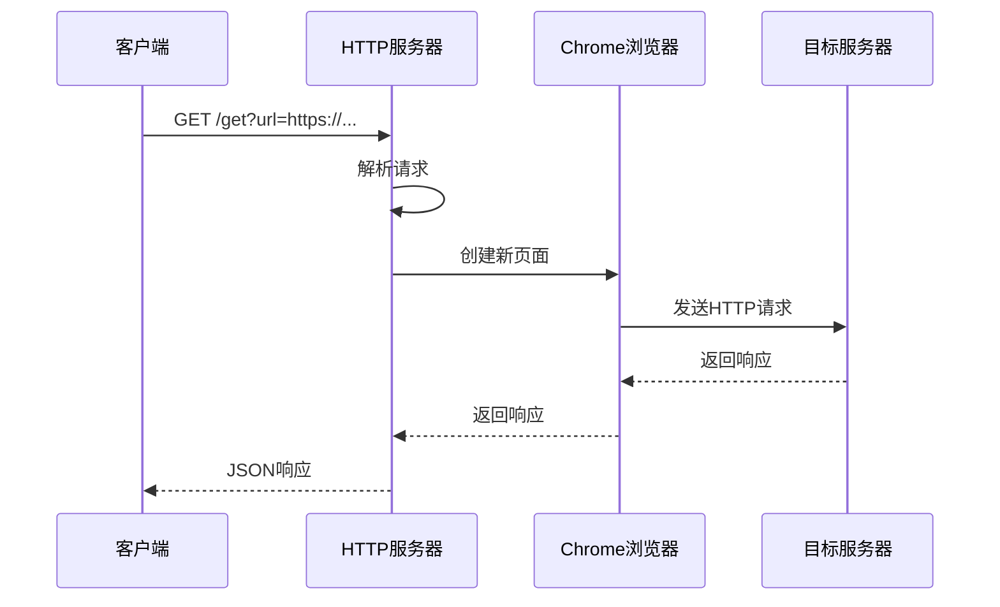
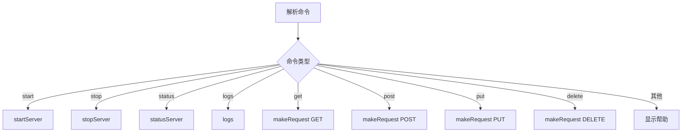
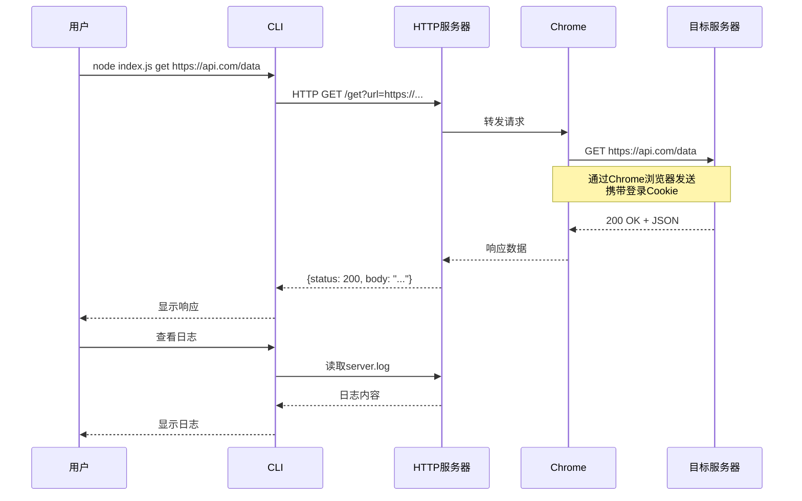
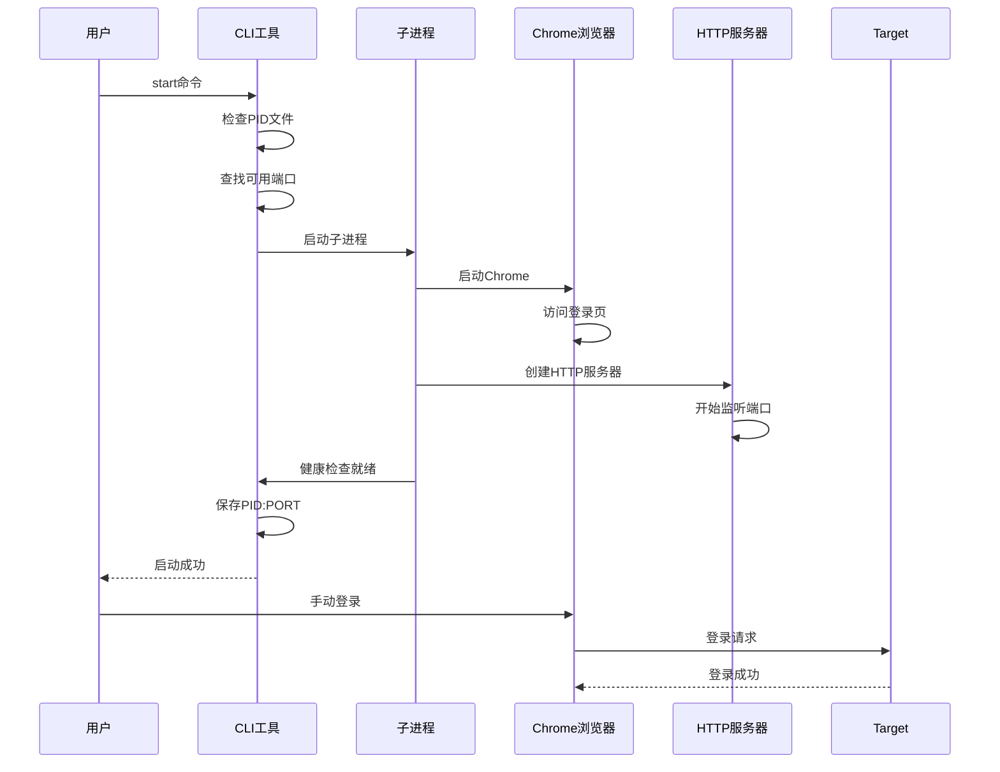

# 技术架构文档

## 1. 系统架构

### 1.1 整体架构图



### 1.2 模块依赖关系



## 2. 核心模块设计

### 2.1 服务管理模块

**职责**：管理系统服务生命周期

#### 主要函数

| 函数名 | 描述 | 参数 | 返回值 |
|--------|------|------|--------|
| `startServer()` | 启动后台服务 | 无 | Promise<void> |
| `stopServer()` | 停止服务 | 无 | void |
| `statusServer()` | 查看服务状态 | 无 | void |
| `logs()` | 查看日志 | 无 | void |

#### 启动流程

```typescript
async function startServer() {
  // 1. 检查服务是否已运行
  if (fs.existsSync(PID_FILE)) {
    const pid = readPID();
    if (isProcessRunning(pid)) {
      console.log('服务已在运行');
      return;
    }
  }

  // 2. 查找可用端口
  let port = BASE_PORT;
  while (await isPortInUse(port)) {
    console.log(`端口 ${port} 已被占用，尝试端口 ${port + 1}...`);
    port++;
  }

  // 3. 使用当前Node进程启动服务
  const runtime = process.execPath;
  const child = spawn(runtime, [__filename, '--server-mode'], {
    detached: true,
    stdio: 'ignore',
    env: { ...process.env, ACTUAL_PORT: String(port) }
  });

  // 4. 保存PID和端口
  child.unref();
  fs.writeFileSync(PID_FILE, `${child.pid}:${port}`);

  // 5. 等待健康检查通过
  await waitForHealth(port);
}
```

### 2.2 HTTP代理模块

**职责**：处理HTTP请求转发

#### 请求处理流程



#### API端点

| 路径 | 方法 | 描述 |
|------|------|------|
| `/health` | GET | 健康检查 |
| `/:method?url=` | GET | 通用代理接口 |
| `/` | OPTIONS | CORS预检 |

### 2.3 浏览器自动化模块

**职责**：通过Playwright控制Chrome浏览器

#### 浏览器配置

```typescript
const browserConfig = {
  headless: false,        // 非无头模式，允许用户交互
  channel: 'chrome',      // 使用系统Chrome
};
```

#### 会话管理

```typescript
// 创建持久化上下文
const context = await browser.newContext();
const page = await context.newPage();

// 访问登录页面
await page.goto(LOGIN_URL);

// 为每个请求创建新页面
const reqPage = await context.newPage();
await reqPage.request.get(targetUrl);
```

### 2.4 进程管理模块

**职责**：管理PID文件和进程控制

#### PID文件格式

```
PID:PORT
例：12345:3000
```

#### 端口管理

```typescript
function isPortInUse(port: number): Promise<boolean> {
  return new Promise((resolve) => {
    const server = createServer();
    server.once('error', () => resolve(true));
    server.once('listening', () => {
      server.close();
      resolve(false);
    });
    server.listen(port);
  });
}
```

## 3. 命令行接口

### 3.1 命令列表

```mermaid
graph TD
    CLI[CLI工具] --> Commands

    Commands --> Service[服务管理]
    Commands --> Request[请求发送]
    Commands --> Utility[实用工具]

    Service --> start[start - 启动服务]
    Service --> stop[stop - 停止服务]
    Service --> status[status - 查看状态]
    Service --> logs[logs - 查看日志]

    Request --> get[get <url> - GET请求]
    Request --> post[post <url> [data] - POST请求]
    Request --> put[put <url> [data] - PUT请求]
    Request --> delete[delete <url> - DELETE请求]

    Utility --> help[--help - 帮助信息]
```

### 3.2 命令执行流程



## 4. 数据流设计

### 4.1 请求数据流



### 4.2 启动时序图



## 5. 文件结构

```
MyCLI/
├── index.ts              # 主入口文件
├── dist/                 # 构建输出目录
│   └── index.js          # 构建后的JavaScript文件
├── node_modules/         # 依赖包
├── server.pid            # 进程ID和端口记录
├── server.log            # 服务运行日志
├── .env                  # 环境变量配置
├── package.json          # 项目配置
├── tsconfig.json         # TypeScript配置
└── README.md            # 项目说明
```

## 6. 环境配置

### 6.1 环境变量

```bash
# .env 文件示例
LOGIN_URL=https://example.com/login
PORT=3000
```

### 6.2 构建配置

```json
// package.json scripts
{
  "scripts": {
    "start": "node dist/index.js",
    "build": "esbuild index.ts --bundle --platform=node --format=esm --outfile=dist/index.js --external:playwright-core --external:electron --external:chromium-bidi --external:dotenv --minify",
    "test": "npm run build && node test.js"
  }
}
```

## 7. 错误处理机制

### 7.1 错误分类

| 错误类型 | 处理方式 | 示例 |
|---------|---------|------|
| 服务未运行 | 返回错误码1 | `makeRequest` 检测 |
| PID文件损坏 | 自动清理 | `statusServer` 异常处理 |
| 端口占用 | 自动递增 | `startServer` 端口检测 |
| 请求失败 | 返回错误响应 | HTTP服务器内部try-catch |
| 浏览器启动失败 | 输出错误并退出 | `runServerMode` 异常处理 |
| 启动超时 | 清理进程并退出 | 30秒超时保护 |

### 7.2 健康检查重试

```typescript
const maxRetries = 30;
const retryInterval = 1000;

while (retries < maxRetries) {
  await sleep(retryInterval);
  try {
    const response = await fetch(`http://localhost:${port}/health`);
    if (response.ok) {
      return true; // 服务就绪
    }
  } catch {
    retries++;
  }
}
return false; // 超时
```

## 8. 安全性考虑

### 8.1 CORS支持

```typescript
res.setHeader('Access-Control-Allow-Origin', '*');
res.setHeader('Access-Control-Allow-Methods', 'GET, POST, PUT, DELETE, OPTIONS');
res.setHeader('Access-Control-Allow-Headers', 'Content-Type');
```

### 8.2 进程隔离

- 服务运行在独立子进程
- 主进程退出不影响服务
- 服务退出自动清理PID文件

### 8.3 输入验证

- URL参数必须提供
- HTTP方法白名单验证
- JSON数据格式检查

## 9. 性能优化

### 9.1 浏览器资源管理

- 每个请求创建独立页面
- 请求完成后关闭页面
- 复用浏览器上下文

### 9.2 并发控制

- HTTP服务器单线程处理
- 请求队列顺序执行
- 避免并发竞争

### 9.3 启动优化

- 使用 `detached: true` 后台运行
- 使用 `process.execPath` 避免路径问题
- 健康检查确认就绪后再返回

## 10. 扩展性设计

### 10.1 插件化扩展

未来可扩展的功能：

- 自定义中间件
- 请求/响应拦截器
- 日志格式化器
- 认证处理器

### 10.2 适配器模式

```typescript
// 可扩展的请求处理器
interface RequestAdapter {
  send(request: Request): Promise<Response>;
}

// 当前实现：Chrome请求
class ChromeRequestAdapter implements RequestAdapter { ... }

// 未来可扩展：Selenium、纯HTTP等
class SeleniumRequestAdapter implements RequestAdapter { ... }
```
