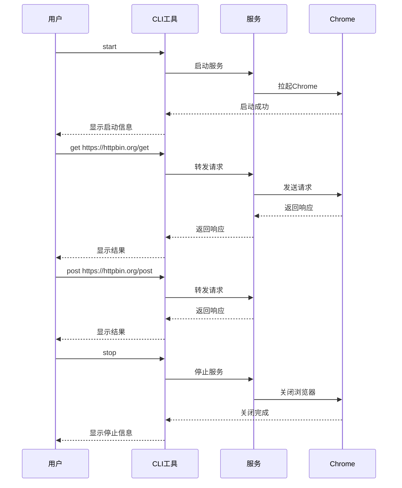

# 端到端测试用例

## 1. 测试概览

### 1.1 测试策略

| 类别 | 用例数 | 说明 |
|------|--------|------|
| **冒烟测试 (P0)** | 3 | 核心功能验证 |
| **正常流程 (P1)** | 3 | 完整使用场景 |
| **异常流程 (P2)** | 3 | 错误处理和边界情况 |
| **总计** | **9** | 精简核心覆盖 |

### 1.2 测试环境要求

- **操作系统**：Windows/macOS/Linux
- **运行时**：Node.js 18+
- **依赖**：Chrome 浏览器已安装
- **依赖包**：已通过 `npm install` 安装

---

## 2. 冒烟测试用例 (P0)

### 2.1 T001: 服务启动

**测试目标**：验证服务能正常启动并拉起Chrome浏览器

**前置条件**：
- 服务未运行
- PID 文件不存在

**测试步骤**：

```bash
# 1. 确保服务未运行
node dist/index.js stop 2>/dev/null || true

# 2. 启动服务
node dist/index.js start
```

**预期结果**：

| 检查点 | 预期 |
|--------|------|
| 控制台输出 | 包含 "使用端口: 3000" |
| 控制台输出 | 包含 "服务已启动 (PID: xxx, 端口: xxx)" |
| Chrome浏览器 | 被拉起并打开登录页面 |
| PID文件 | 被创建，格式为 `PID:PORT` |

**验证命令**：

```bash
# 验证健康检查
curl http://localhost:3000/health
# 预期输出: {"status":"ok","port":3000}
```

**通过标准**：
- [ ] Chrome 浏览器被拉起
- [ ] 控制台显示启动成功信息
- [ ] 健康检查接口正常响应

---

### 2.2 T002: HTTP请求转发

**测试目标**：验证GET和POST请求能正确转发并返回响应

**前置条件**：服务已启动

**测试步骤**：

```bash
# 1. GET请求测试
node dist/index.js get https://httpbin.org/get

# 2. POST请求测试
node dist/index.js post https://httpbin.org/post '{"name":"test"}'

# 3. PUT请求测试
node dist/index.js put https://httpbin.org/put '{"key":"value"}'

# 4. DELETE请求测试
node dist/index.js delete https://httpbin.org/delete
```

**预期结果**：

| 请求类型 | 响应状态 |
|----------|----------|
| GET | 200 |
| POST | 200 |
| PUT | 200 |
| DELETE | 200 |

**通过标准**：
- [ ] 所有请求返回成功 (exitCode = 0)
- [ ] 控制台显示响应状态码
- [ ] 控制台显示响应内容

---

### 2.3 T003: 构建成功

**测试目标**：验证项目能成功构建为可执行文件

**前置条件**：依赖已安装

**测试步骤**：

```bash
# 1. 清理旧的构建文件
rm -rf dist

# 2. 执行构建
npm run build

# 3. 检查输出
ls -la dist/index.js
```

**预期结果**：

| 检查点 | 预期 |
|--------|------|
| dist目录 | 存在 |
| dist/index.js | 文件存在 |
| 文件大小 | 5KB - 100KB |
| 错误输出 | 无错误 |

**通过标准**：
- [ ] 构建命令成功执行
- [ ] dist/index.js 文件生成
- [ ] 文件大小在合理范围内

---

## 3. 正常流程测试 (P1)

### 3.1 T004: 完整请求流程

**测试目标**：验证 start → 请求 → stop 的完整使用流程

**测试步骤**：



**测试命令**：

```bash
# 完整流程
node dist/index.js start
sleep 5
node dist/index.js get https://httpbin.org/get
node dist/index.js post https://httpbin.org/post '{"name":"cli-test"}'
node dist/index.js stop
```

**预期结果**：

| 步骤 | 预期输出 |
|------|----------|
| start | "服务已启动 (PID: xxx, 端口: xxx)" |
| get | "响应状态: 200" |
| post | "响应状态: 200" |
| stop | "服务已停止 (PID: xxx)" |

**通过标准**：
- [ ] 服务能正常启动
- [ ] GET请求成功
- [ ] POST请求成功
- [ ] 服务能正常停止

---

### 3.2 T005: 服务状态查看

**测试目标**：验证能正确查看服务运行状态

**测试步骤**：

```bash
# 场景1: 服务运行中
node dist/index.js start
sleep 3
node dist/index.js status

# 场景2: 服务停止后
node dist/index.js stop
node dist/index.js status
```

**预期结果**：

| 场景 | 预期输出 |
|------|----------|
| 运行中 | "服务运行中 (PID: xxx, 端口: xxx)" |
| 已停止 | "服务未运行" |

**通过标准**：
- [ ] 运行中时显示正确的PID和端口
- [ ] 停止后显示"服务未运行"

---

### 3.3 T006: 日志查看

**测试目标**：验证能正确查看服务日志

**测试步骤**：

```bash
# 1. 启动服务
node dist/index.js start
sleep 5

# 2. 发送一个请求生成日志
node dist/index.js get https://httpbin.org/get

# 3. 查看日志
node dist/index.js logs
```

**预期日志内容**：

```
正在启动Chrome浏览器...
正在访问: https://example.com/login
服务器运行在 http://localhost:3000

收到请求: GET /get
响应状态: 200
```

**通过标准**：
- [ ] 日志包含 "正在启动Chrome浏览器"
- [ ] 日志包含 "服务器运行在"
- [ ] 日志包含请求记录

---

## 4. 异常流程测试 (P2)

### 4.1 T007: 服务未运行时请求

**测试目标**：验证服务未启动时发送请求能正确报错

**测试步骤**：

```bash
# 1. 确保服务未运行
node dist/index.js stop 2>/dev/null || true

# 2. 尝试发送请求
node dist/index.js get https://httpbin.org/get
```

**预期结果**：

| 检查点 | 预期 |
|--------|------|
| 命令退出码 | 非0 (失败) |
| 控制台输出 | 包含 "服务未运行" |

**通过标准**：
- [ ] 命令返回非零退出码
- [ ] 错误信息清晰

---

### 4.2 T008: 端口占用处理

**测试目标**：验证端口被占用时能自动切换到下一个端口

**前置条件**：端口 3000 被占用

**测试步骤**：

```bash
# 场景1: 使用 netcat 或其他工具占用端口 3000
# Windows: 
#   $listener = [System.Net.Sockets.TcpListener]::Parse('0.0.0.0:3000')
#   $listener.Start()

# 2. 启动服务
node dist/index.js start
```

**预期结果**：

| 检查点 | 预期 |
|--------|------|
| 控制台输出 | 包含 "端口 3000 已被占用，尝试端口 3001..." |
| 服务运行端口 | 3001 |
| PID文件内容 | `PID:3001` |

**通过标准**：
- [ ] 自动检测到端口占用
- [ ] 自动递增到下一个端口
- [ ] 最终服务正常运行

---

### 4.3 T009: PID文件损坏

**测试目标**：验证PID文件损坏时能正常处理

**测试步骤**：

```bash
# 1. 创建损坏的PID文件
echo "invalid-content" > server.pid

# 2. 尝试查看状态
node dist/index.js status
```

**预期结果**：

| 检查点 | 预期 |
|--------|------|
| 命令退出码 | 0 (正常处理) |
| 控制台输出 | "服务未运行" |
| PID文件 | 被清理删除 |

**通过标准**：
- [ ] 不抛出异常
- [ ] 错误信息清晰
- [ ] PID文件被清理

---

## 5. 测试执行指南

### 5.1 快速冒烟测试

适合开发过程中快速验证：

```bash
# 1. 构建
npm run build

# 2. 启动并测试
node dist/index.js start
sleep 5

# 3. 验证
curl http://localhost:3000/health

# 4. 发送请求
node dist/index.js get https://httpbin.org/get

# 5. 停止
node dist/index.js stop
```

### 5.2 完整测试流程

每次代码变更后执行：

```bash
#!/bin/bash
# test-full.sh

set -e

echo "=== 开始完整测试 ==="

# 清理
node dist/index.js stop 2>/dev/null || true
rm -f server.pid server.log

# T001: 服务启动
echo "=== T001: 服务启动 ==="
node dist/index.js start
sleep 5
curl -s http://localhost:3000/health

# T005: 状态查看
echo "=== T005: 状态查看 ==="
node dist/index.js status

# T002: GET请求
echo "=== T002: GET请求 ==="
node dist/index.js get https://httpbin.org/get

# T002: POST请求
echo "=== T002: POST请求 ==="
node dist/index.js post https://httpbin.org/post '{"name":"test"}'

# T006: 日志查看
echo "=== T006: 日志查看 ==="
node dist/index.js logs

# T007: 异常-服务未运行
echo "=== T007: 异常-服务未运行 ==="
node dist/index.js stop
node dist/index.js get https://httpbin.org/get || echo "预期失败"

# T009: 异常-PID文件损坏
echo "=== T009: 异常-PID文件损坏 ==="
echo "invalid" > server.pid
node dist/index.js status
rm -f server.pid

# T003: 构建测试
echo "=== T003: 构建测试 ==="
rm -rf dist
npm run build
ls -la dist/index.js

echo "=== 测试完成 ==="
```

### 5.3 测试检查清单

执行测试后检查：

- [ ] **T001**: Chrome 被拉起，健康检查通过
- [ ] **T002**: GET/POST/PUT/DELETE 请求都成功
- [ ] **T003**: 构建成功，文件大小合理
- [ ] **T004**: 完整流程无错误
- [ ] **T005**: 状态查看准确
- [ ] **T006**: 日志正确记录
- [ ] **T007**: 异常正确处理
- [ ] **T008**: 端口自动切换
- [ ] **T009**: PID损坏正确处理

---

## 6. 测试用例状态

| 用例ID | 用例名称 | 优先级 | 状态 |
|--------|----------|--------|------|
| T001 | 服务启动 | P0 | 待测试 |
| T002 | HTTP请求转发 | P0 | 待测试 |
| T003 | 构建成功 | P0 | 待测试 |
| T004 | 完整请求流程 | P1 | 待测试 |
| T005 | 服务状态查看 | P1 | 待测试 |
| T006 | 日志查看 | P1 | 待测试 |
| T007 | 服务未运行时请求 | P2 | 待测试 |
| T008 | 端口占用处理 | P2 | 待测试 |
| T009 | PID文件损坏 | P2 | 待测试 |

---

## 7. 已知限制

1. **浏览器依赖**：测试需要系统已安装 Chrome 浏览器
2. **网络依赖**：HTTP转发测试需要访问外部网络 (httpbin.org)
3. **端口冲突**：如果端口被占用，测试会自动切换端口
4. **并发限制**：测试脚本顺序执行，不支持并发测试
