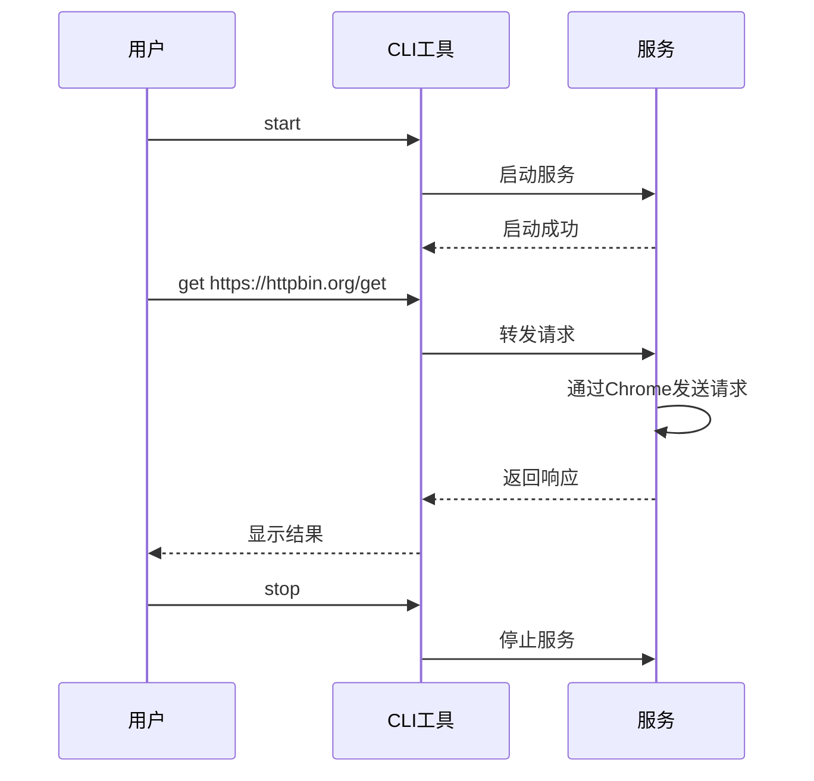

# 测试用例设计

## 1. 测试策略

### 1.1 测试分类

| 类别 | 说明 | 优先级 |
|------|------|--------|
| **冒烟测试** | 核心功能验证，确保基本可用 | P0 |
| **正常流程** | 完整使用场景的端到端测试 | P1 |
| **异常流程** | 错误处理和边界情况 | P2 |

### 1.2 精简后的用例清单

#### 冒烟测试 (P0) - 核心功能

| 用例ID | 用例名称 | 测试内容 |
|--------|----------|----------|
| T001 | 服务启动 | 服务能正常启动并拉起Chrome |
| T002 | HTTP请求转发 | GET请求能正确转发并返回响应 |
| T003 | 构建成功 | 项目能成功构建为可执行文件 |

#### 正常流程测试 (P1)

| 用例ID | 用例名称 | 测试内容 |
|--------|----------|----------|
| T004 | 完整请求流程 | start → GET/POST → stop 全流程 |
| T005 | 服务状态查看 | 能正确查看服务运行状态 |
| T006 | 日志查看 | 能正确查看服务日志 |

#### 异常流程测试 (P2)

| 用例ID | 用例名称 | 测试内容 |
|--------|----------|----------|
| T007 | 服务未运行时请求 | 服务未启动时发送请求应报错 |
| T008 | 端口占用处理 | 端口被占用时能自动切换 |
| T009 | PID文件损坏 | PID文件损坏时能正常处理 |

---

## 2. 详细用例设计

### 2.1 冒烟测试用例

#### T001: 服务启动

**前置条件**: 服务未运行  
**测试步骤**:
```bash
node dist/index.js start
```

**预期结果**:
- Chrome 浏览器被拉起
- 命令输出 "服务已启动 (PID: xxx, 端口: xxx)"
- PID 文件被创建

**验证命令**:
```bash
curl http://localhost:3000/health
# 预期: {"status":"ok","port":3000}
```

---

#### T002: HTTP请求转发

**前置条件**: 服务已启动  
**测试步骤**:
```bash
node dist/index.js get https://httpbin.org/get
```

**预期结果**:
- 命令返回成功 (exitCode = 0)
- 输出包含 "响应状态: 200"
- 输出包含响应内容

---

#### T003: 构建成功

**前置条件**: 依赖已安装  
**测试步骤**:
```bash
npm run build
```

**预期结果**:
- dist/index.js 文件生成
- 文件大小在 5KB - 100KB 之间
- 无错误输出

---

### 2.2 正常流程测试

#### T004: 完整请求流程

**测试步骤**:


**测试命令**:
```bash
# 1. 启动
node dist/index.js start
sleep 3

# 2. GET请求
node dist/index.js get https://httpbin.org/get

# 3. POST请求
node dist/index.js post https://httpbin.org/post '{"name":"test"}'

# 4. 停止
node dist/index.js stop
```

**预期结果**:
- 每个命令都成功执行
- 响应状态码为 200

---

#### T005: 服务状态查看

**测试步骤**:
```bash
# 服务运行中
node dist/index.js status
# 预期: 服务运行中 (PID: xxx, 端口: xxx)

# 服务停止后
node dist/index.js stop
node dist/index.js status
# 预期: 服务未运行
```

---

#### T006: 日志查看

**测试步骤**:
```bash
node dist/index.js start
sleep 3
node dist/index.js logs
```

**预期结果**:
- 日志包含 "正在启动Chrome浏览器"
- 日志包含 "服务器运行在"

---

### 2.3 异常流程测试

#### T007: 服务未运行时请求

**测试步骤**:
```bash
node dist/index.js stop
node dist/index.js get https://httpbin.org/get
```

**预期结果**:
- 命令失败 (exitCode = 1)
- 输出包含 "服务未运行"

---

#### T008: 端口占用处理

**前置条件**: 端口 3000 被占用  
**测试步骤**:
1. 启动一个占用端口 3000 的服务
2. 执行 `node dist/index.js start`

**预期结果**:
- 控制台输出 "端口 3000 已被占用，尝试端口 3001..."
- 服务最终运行在端口 3001

---

#### T009: PID文件损坏

**测试步骤**:
```bash
echo "invalid-content" > server.pid
node dist/index.js status
```

**预期结果**:
- 输出 "服务未运行"
- 不抛出异常

---

## 3. 测试执行指南

### 3.1 快速冒烟测试

适合开发过程中快速验证：

```bash
# 构建
npm run build

# 测试
node dist/index.js start
sleep 5
curl http://localhost:3000/health
node dist/index.js get https://httpbin.org/get
node dist/index.js stop
```

### 3.2 完整测试流程

每次代码变更后执行：

```bash
# 清理
node dist/index.js stop 2>/dev/null
rm -f server.pid server.log

# 构建
npm run build

# T001: 服务启动
echo "=== T001: 服务启动 ==="
node dist/index.js start
sleep 5

# T005: 状态查看
echo "=== T005: 状态查看 ==="
node dist/index.js status

# T002: GET请求
echo "=== T002: GET请求 ==="
node dist/index.js get https://httpbin.org/get

# T004: POST请求
echo "=== T004: POST请求 ==="
node dist/index.js post https://httpbin.org/post '{"name":"test"}'

# T006: 日志查看
echo "=== T006: 日志查看 ==="
node dist/index.js logs

# T007: 异常-服务未运行
echo "=== T007: 异常-服务未运行 ==="
node dist/index.js stop
node dist/index.js get https://httpbin.org/get

# T009: 异常-PID文件损坏
echo "=== T009: 异常-PID文件损坏 ==="
echo "invalid" > server.pid
node dist/index.js status
rm -f server.pid

# T003: 构建测试
echo "=== T003: 构建测试 ==="
rm -rf dist
npm run build
ls -la dist/index.js
```

### 3.3 测试检查清单

执行测试后检查：

- [ ] 服务启动成功，Chrome 被拉起
- [ ] /health 接口返回正确
- [ ] GET/POST 请求成功转发
- [ ] 服务能正常停止
- [ ] 状态和日志命令正常
- [ ] 异常情况处理正确

---

## 4. 简化测试脚本

建议使用简化后的测试脚本 `simple-test.ts`，包含 9 个核心用例：

```typescript
// 核心测试用例
const testCases = [
  'T001: 服务启动',
  'T002: HTTP请求转发',
  'T003: 构建成功',
  'T004: 完整请求流程',
  'T005: 服务状态查看',
  'T006: 日志查看',
  'T007: 服务未运行时请求',
  'T008: 端口占用处理',
  'T009: PID文件损坏'
];
```

相比之前的 24 个用例，精简为 9 个核心用例，聚焦于：
- 核心功能正常工作
- 完整使用流程可用
- 关键异常能正确处理
